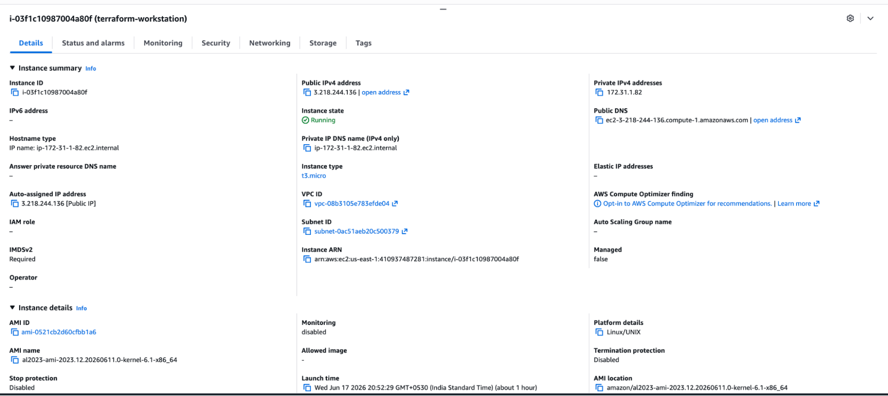
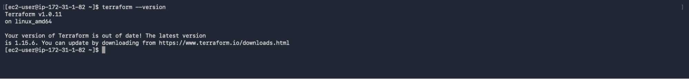
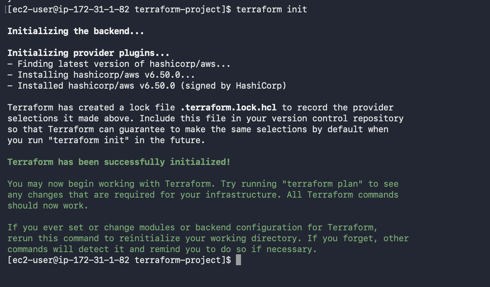
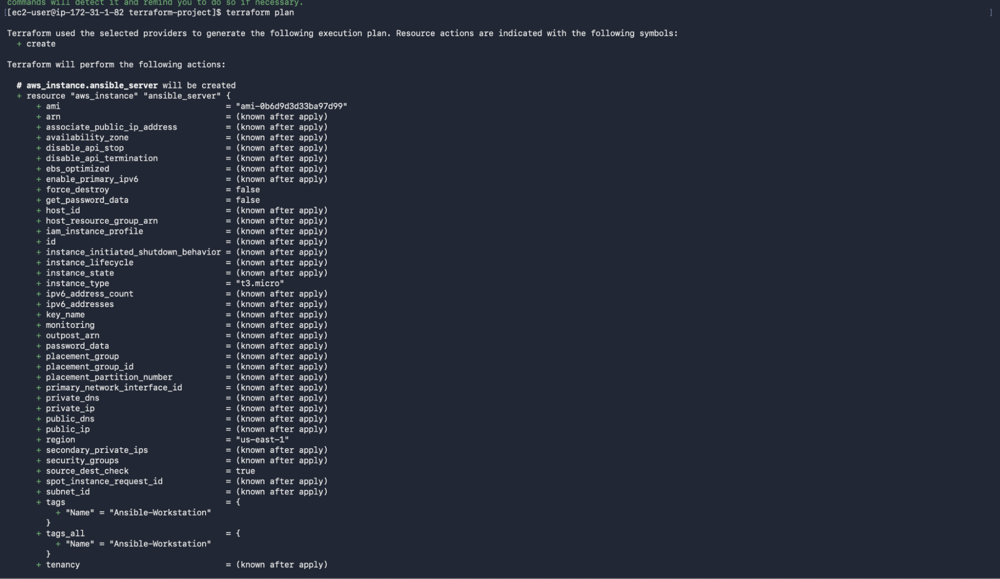
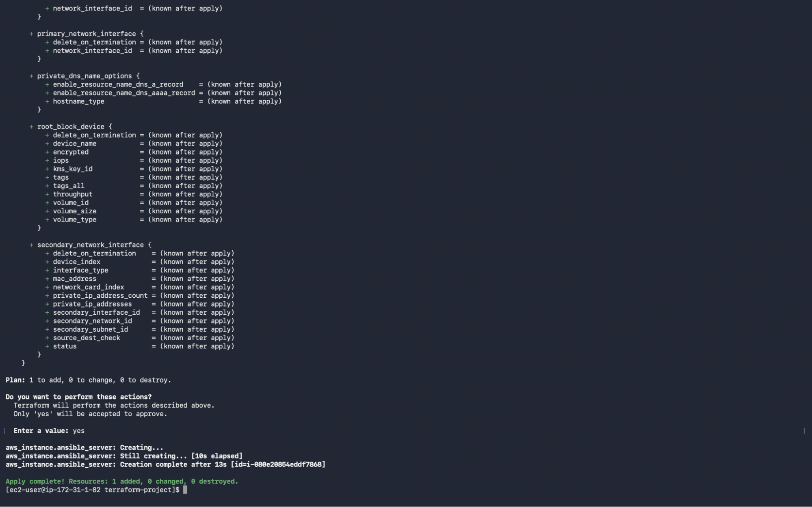
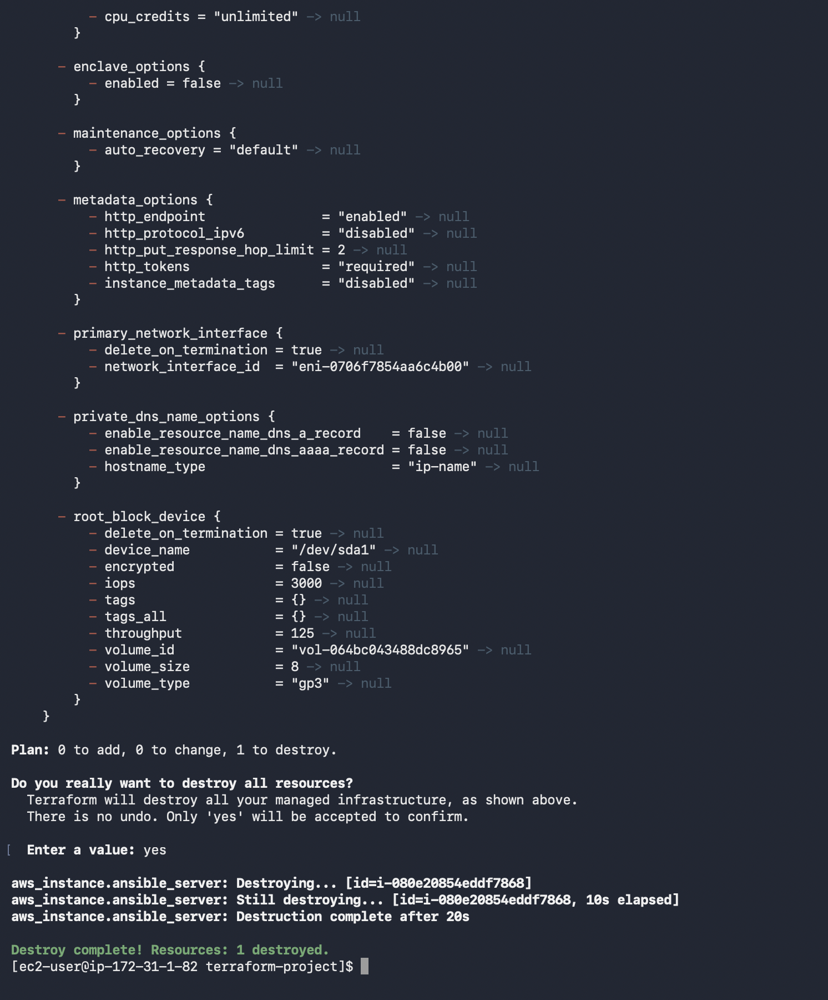

# Terraform AWS EC2 Provisioning

## Project Overview

Provisioned and managed an AWS EC2 instance using Terraform by implementing Infrastructure as Code (IaC). This project covers the complete infrastructure lifecycle, including AWS authentication, infrastructure planning, EC2 provisioning, infrastructure verification, and resource cleanup.

---

## Project Goal

Provision and manage AWS infrastructure using Terraform instead of manually creating resources through the AWS Management Console while understanding the complete Infrastructure as Code workflow.

---

## Implementation Journey

### Step 1 - Terraform Workstation Setup

- Launched an Ubuntu EC2 instance as the Terraform workstation.
- Connected to the instance using SSH.
- Installed Terraform and verified the installation.

---

### Step 2 - AWS Authentication

- Configured AWS CLI credentials using `aws configure`.
- Verified successful authentication before provisioning infrastructure.

---

### Step 3 - Terraform Initialization

- Created the Terraform configuration files.
- Initialized the project using `terraform init`.
- Downloaded the required AWS provider plugins.

---

### Step 4 - Infrastructure Planning

- Validated the Terraform configuration.
- Reviewed the execution plan using `terraform plan`.
- Verified the resources before provisioning.

---

### Step 5 - Infrastructure Provisioning

- Applied the Terraform configuration using `terraform apply`.
- Successfully provisioned an AWS EC2 instance.

---

### Step 6 - Infrastructure Verification

- Verified the EC2 instance from the AWS Management Console.
- Confirmed that the infrastructure was provisioned successfully.

---

### Step 7 - Infrastructure Cleanup

- Destroyed all AWS resources using `terraform destroy`.
- Verified that the infrastructure was cleaned up successfully.

---

## Challenges Faced

### Challenge 1 - Loss of Terraform Workstation

**Issue**

The EC2 instance used as the Terraform workstation was accidentally terminated, resulting in the loss of local Terraform configuration files.

**Resolution**

Recreated the project using my implementation notes and documentation. Moved the project to GitHub to maintain version control.

**Learning**

Infrastructure should always be version-controlled and reproducible.

---

### Challenge 2 - AWS Authentication

**Issue**

Terraform requires valid AWS credentials before provisioning resources.

**Resolution**

Configured AWS CLI credentials using `aws configure` and verified authentication before executing Terraform commands.

**Learning**

Always verify cloud authentication before provisioning infrastructure.

---

### Challenge 3 - Understanding the Terraform Workflow

**Issue**

Initially focused only on provisioning resources.

**Resolution**

Implemented the complete workflow, including initialization, planning, provisioning, verification, and infrastructure cleanup.

**Learning**

Infrastructure provisioning is only one part of the complete Terraform lifecycle.

---

## Key Learnings

- Implemented Infrastructure as Code using Terraform.
- Provisioned AWS EC2 instances through declarative configuration.
- Understood the complete Terraform workflow from initialization to destruction.
- Worked with Terraform variables and outputs.
- Learned the importance of Terraform state management.
- Understood why Infrastructure as Code should always be version-controlled.

---

## Project Outcome

Successfully provisioned and managed AWS EC2 infrastructure using Terraform while implementing the complete Infrastructure as Code workflow. This project improved my understanding of AWS infrastructure automation, Terraform lifecycle management, and reproducible deployments.

---

## Source Code

The Terraform configuration files used in this project are available in the `source-code` directory.

- main.tf
- variables.tf
- outputs.tf
